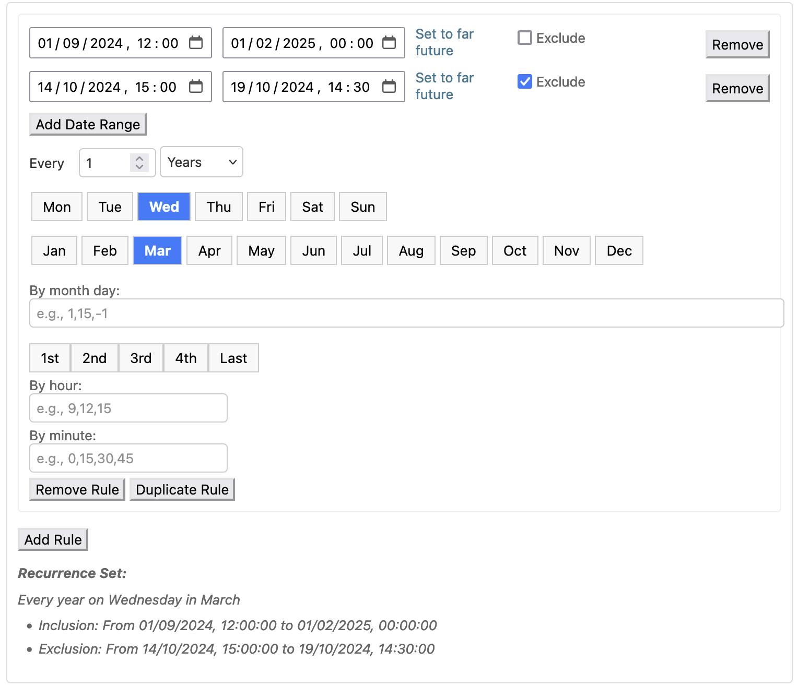

=====
Admin
=====

Widget
------

django-recurring ships with a widget for the Django admin interface to create complex intervals easily:

iCal
------
The iCal string for the recurrence set is also displayed in the admin, e.g.:

.. image:: ical.png
   :alt: iCal image
   :align: center
