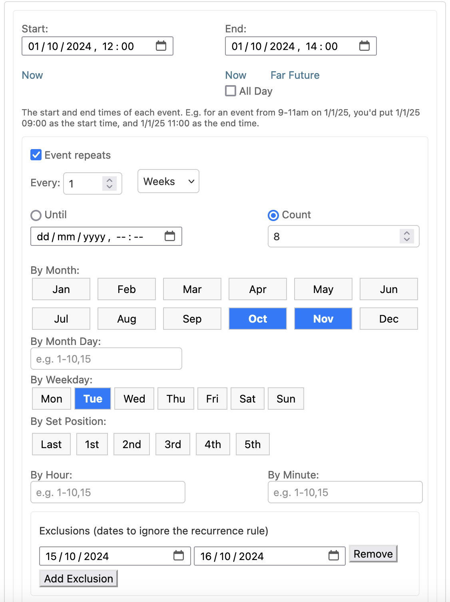
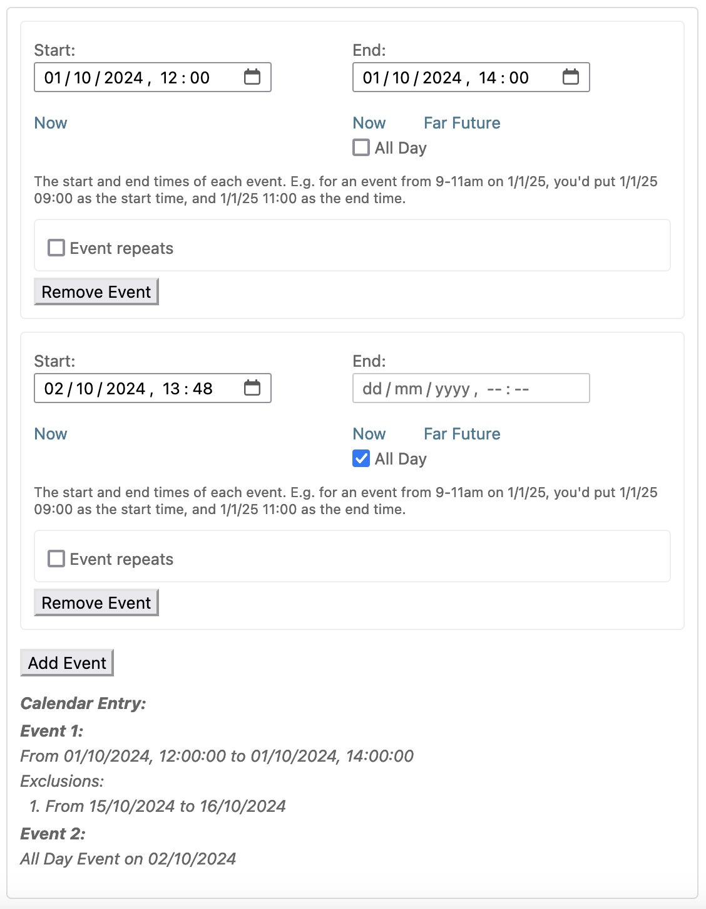
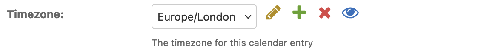
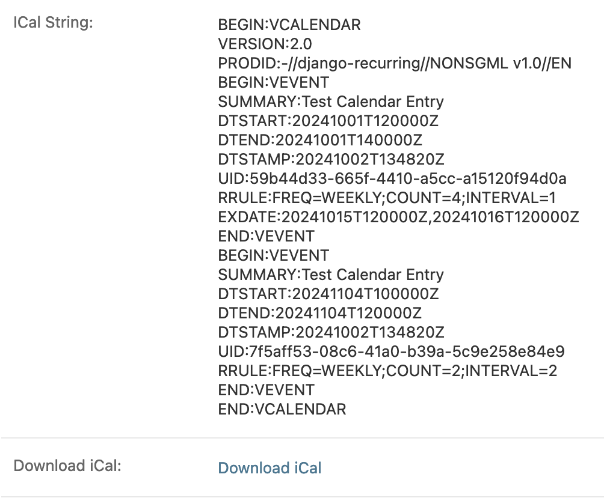
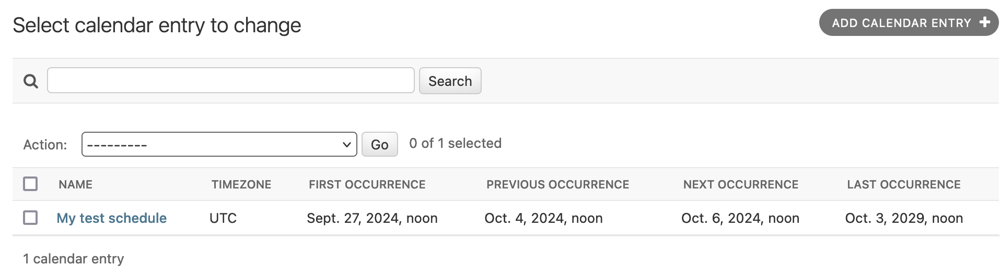

=====
Admin
=====

Widget
------

django-recurring ships with a javascript widget for the Django admin interface to create complex intervals easily. Recurrence rules can have multiple exclusions:

It supports multiple events, each with recurrence patterns:

Together, this allows creating complex recurrences like:

    Every Monday in Jan & Feb, every Tuesday in Mar and Apr, except the 3rd weeks of Feb and Apr.

Timezones
---------
Event times can be associated with any timezone. Just create/select them in the admin:

Enter all times in the main widget in your selected timezone's local time.

iCal
------
The iCal string for the calendar entry is also displayed in the admin and can be downloaded as an ical (.ics) file:

List view
---------
The admin also includes the precomputed :ref:`occurrence fields <recalculating-occurrences>` in the list view by default:

