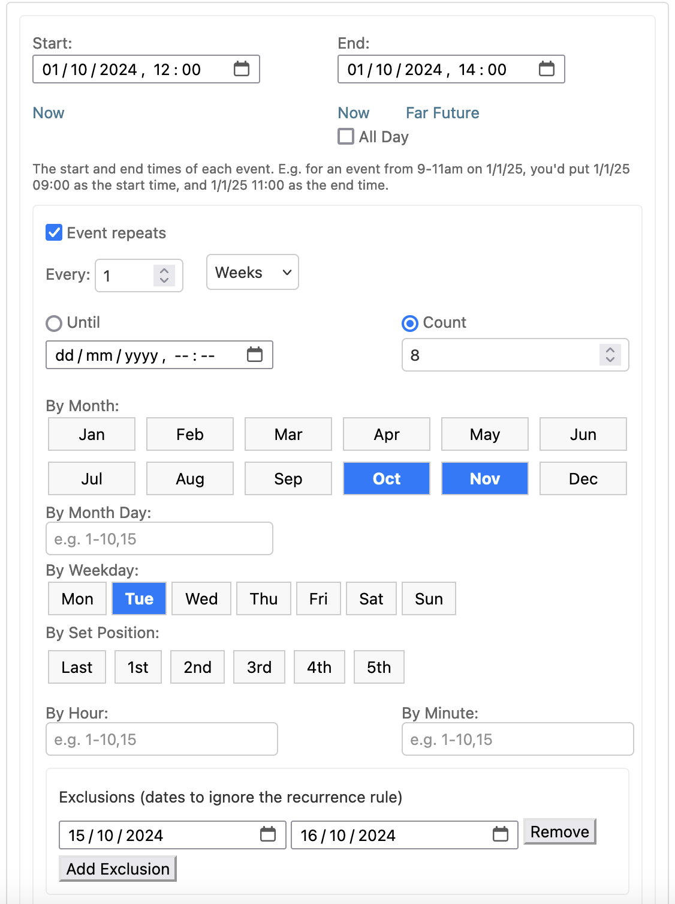
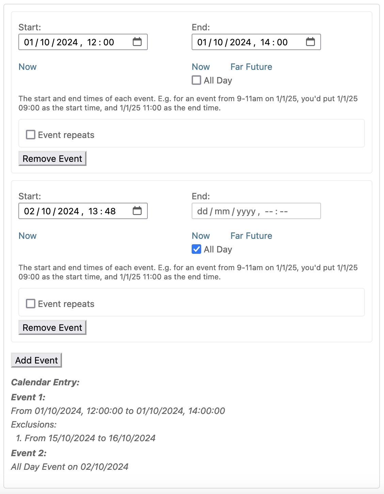
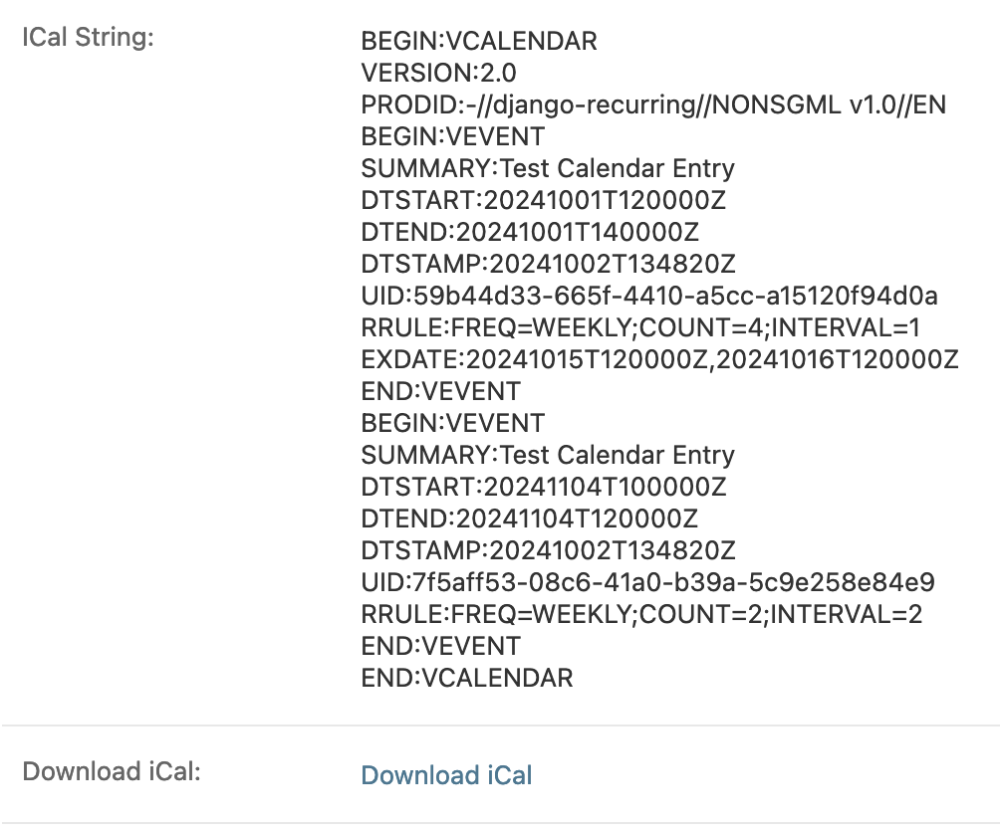

=====
Admin
=====

Widget
------

django-recurring ships with a javascript widget for the Django admin interface to create complex intervals easily. Recurrence rules can have multiple exclusions:

It supports multiple events, each with recurrence patterns:

Together, this allows creating recurrences like: every Monday in Jan & Feb, every Tuesday in Mar and Apr, except the 3rd week of Feb and Apr.

iCal
------
The iCal string for the recurrence set is also displayed in the admin and can be downloaded as an ical (.ics) file:

